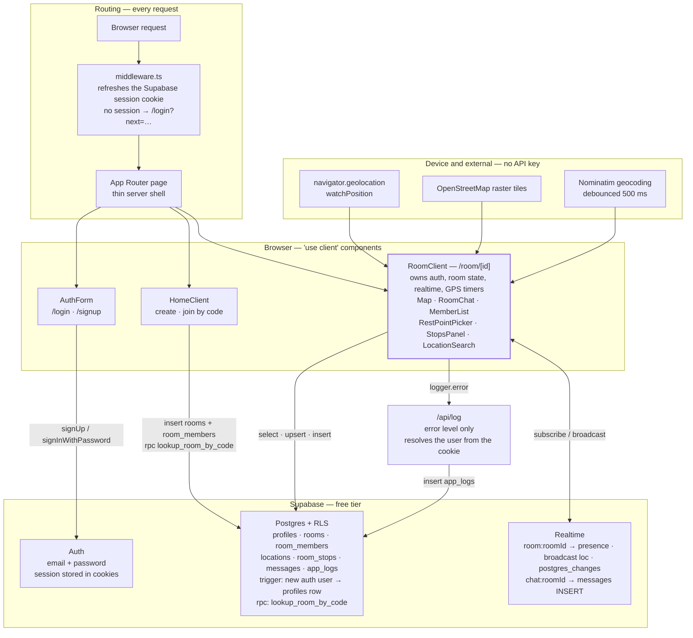
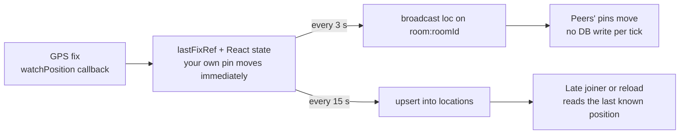

# Link 
https://heybuddy0.vercel.app/

# Travel with Friends — Live Map

A 100%-free web app where friends create or join a travel "room" by code, see each other on a live map, follow a **host-set destination**, and chat in real time.

Built on a fully free stack:
- **Next.js 14** + TypeScript + Tailwind CSS
- **Supabase** (Auth, Postgres, Realtime) — free tier, no credit card
- **Leaflet + OpenStreetMap** — no API key, no quota
- **Vercel** — free hosting

## Features

- Email + password auth (Supabase)
- Create a room, get a 6-character shareable code (e.g. `K7QXB2`)
- Join a room with a code
- Live location pins for everyone in the room (updates every ~3 seconds)
- Online/offline indicator (Realtime presence)
- **Destination** on the map — only the person who created the room can set or change it; everyone in the room sees it (stored as `rooms.rest_point`). Optional: use your current GPS when creating the room.
- Group chat with optimistic UI
- Structured logging that persists ERROR-level events to a `app_logs` table so you can debug from the Supabase dashboard

## Architecture at a glance

There is no custom backend. Apart from `middleware.ts` and one route handler (`/api/log`), the browser talks to Supabase directly — which means the row-level security policies in `supabase/policies.sql` are the entire authorization layer.



A few things the diagram is trying to make obvious:

- **Pages are thin.** `app/room/[id]/page.tsx` is five lines; everything real happens in `components/RoomClient.tsx`.
- **`middleware.ts` gates navigation, not data.** It refreshes the session and redirects, but Supabase queries bypass it entirely and are guarded by RLS instead.
- **Joining can't read `rooms` directly.** The `rooms` SELECT policy requires you to already be a member, so `HomeClient` resolves a share code through the `lookup_room_by_code` function.

## 1. Set up Supabase (one-time, ~3 min)

1. Go to <https://app.supabase.com> and create a free project. Save the **database password** somewhere — you won't need it after this step.
2. Wait for the project to finish provisioning.
3. In the project sidebar go to **Project Settings → API** and copy:
   - `Project URL` (looks like `https://xxxxxxxxxxxx.supabase.co`)
   - `anon public` API key
4. Open the **SQL Editor** in the sidebar.
   - **Option A (single paste):** run [`supabase/full-console-setup.sql`](supabase/full-console-setup.sql) once — it includes schema, Realtime publication (idempotent), and all RLS policies (including **owner-only** `rooms` updates).
   - **Option B (two steps):** paste [`supabase/schema.sql`](supabase/schema.sql) and **Run**, then [`supabase/policies.sql`](supabase/policies.sql) and **Run**.
   - **Then, either way:** run [`supabase/migrations/add_room_stops.sql`](supabase/migrations/add_room_stops.sql). Neither option above creates `room_stops`, so without it the **Stops** panel fails on its first query.
   - If you already ran SQL **before** the join-by-code fix, run [`supabase/migrate-lookup-room-by-code.sql`](supabase/migrate-lookup-room-by-code.sql) once so guests can resolve a room code (see function `lookup_room_by_code`).
5. (Optional, recommended for development) In **Authentication → Providers → Email**, turn off **"Confirm email"** so you can sign up and log in immediately without checking your inbox. For production you should leave it on.

## 2. Configure local env

```bash
cp .env.local.example .env.local
```

Then edit `.env.local`:

```
NEXT_PUBLIC_SUPABASE_URL=https://YOUR-PROJECT-REF.supabase.co
NEXT_PUBLIC_SUPABASE_ANON_KEY=YOUR-ANON-PUBLIC-KEY
```

## 3. Install and run

Requires **Node.js 18.17+** (or 20+).

```bash
npm install
npm run dev
```

Open <http://localhost:3000>.

> **Allow location** when the browser prompts you. Without it, your pin won't move.

### Test with two users

The simplest way: open the app in a normal window **and** an incognito window. Sign up two accounts with different emails. In one window create a room and copy the code. In the other window join with the code. You will see two pins.

> Geolocation requires HTTPS (or `localhost`). On `localhost` it works fine.

## 4. Deploy free on Vercel

1. Push this folder to a GitHub repo.
2. Go to <https://vercel.com>, click **Add New → Project**, import your repo.
3. In **Environment Variables**, add the same two values as in your `.env.local`:
   - `NEXT_PUBLIC_SUPABASE_URL`
   - `NEXT_PUBLIC_SUPABASE_ANON_KEY`
4. Click **Deploy**. Done — you have a public URL you can share with friends.

> Vercel only serves over HTTPS, so geolocation will work in production.

## 5. Where to view logs and errors

There are two log destinations.

**A. Browser DevTools console** — every `logger.info/warn/error(...)` call prints there with timestamp, level, and source. Open DevTools (F12) and watch the Console tab while using the app.

**B. Supabase `app_logs` table** — every ERROR-level call also POSTs to `/api/log`, which inserts a row server-side. To view recent failures:

1. In Supabase, open **Table Editor → app_logs**, OR
2. Open **SQL Editor** and run:

```sql
select created_at, source, message, context, user_id
from app_logs
order by created_at desc
limit 100;
```

Sources currently used: `auth`, `home`, `room`, `chat`, `geolocation`, `react`, `supabaseClient`.

## 6. Project layout

```
travel-map/
  app/
    layout.tsx              # root layout + ErrorBoundary
    page.tsx                # home (Create / Join room)
    login/page.tsx          # email + password sign-in
    signup/page.tsx         # email + password sign-up
    room/[id]/page.tsx      # the live room page
    api/log/route.ts        # server route that inserts errors into app_logs
    globals.css
  components/
    AuthForm.tsx            # shared by login & signup
    HomeClient.tsx          # Create / Join room logic
    RoomClient.tsx          # the big one: map + realtime + geolocation
    Map.tsx                 # Leaflet map (dynamic-imported, client only)
    MemberList.tsx
    RoomChat.tsx
    RestPointPicker.tsx     # destination panel (owner only)
    StopsPanel.tsx          # up to 2 waypoint stops, any member
    LocationSearch.tsx      # debounced Nominatim search box
    ErrorBoundary.tsx
  lib/
    supabaseClient.ts       # singleton browser client
    logger.ts               # structured logger -> console + /api/log
    geolocation.ts          # navigator.geolocation.watchPosition wrapper
    roomCode.ts             # 6-char unambiguous code generator
    types.ts                # shared types
  supabase/
    schema.sql              # tables + trigger that creates a profile on signup
    policies.sql            # row-level security
    full-console-setup.sql  # schema + policies in one paste
    migrations/
      add_room_stops.sql    # room_stops table + its RLS policies
  middleware.ts             # redirects unauth'd users to /login
  .env.local.example
  package.json
  tailwind.config.ts
  tsconfig.json
  next.config.mjs
  postcss.config.mjs
```

## 7. How the realtime layer works

For each room there is a single Supabase Realtime channel `room:{roomId}` doing three jobs:

| Mechanism | What it carries | Why |
| --- | --- | --- |
| **Presence** | `{ userId, displayName }` per online client | Drives the green/grey "online" dot in the member list |
| **Broadcast** event `loc` | `{ userId, displayName, lat, lng, accuracy, ts }` every ~3s | Moves pins on the map without writing to the DB on every tick (cheap on the free tier) |
| **Postgres changes** on `rooms`, `room_members` and `room_stops` | Updated destination (`rest_point`), new joiners, added/removed stops | Keeps the room state in sync for everyone |

A separate channel `chat:{roomId}` listens for INSERTs on `messages` for the chat panel.

In addition, every ~15 seconds the client upserts its latest position into the `locations` table. This is so a friend who **reloads** or **joins late** sees everyone's last-known position immediately, instead of staring at an empty map until the next broadcast.

So a single GPS fix fans out along three paths with three different cadences:



Your own pin never comes back over the channel — the room channel is created with `broadcast: { self: false }`, so it is driven straight from the geolocation callback.

## 8. Free-tier quotas to be aware of

The Supabase free tier easily covers a small group of friends. You only need to think about quotas if you push past:

- 500 MB Postgres storage
- 50,000 monthly active users
- 200 concurrent realtime peers per project
- 2 GB egress per month

For chat + low-frequency location upserts these limits are very far away.

## 9. Out of scope (good follow-ups)

- Background location while the tab is closed (needs a PWA + service worker; iOS Safari restrictions make it fragile)
- Photo / image messages in chat
- Marker clustering when many members are zoomed out
- Routing / ETA between you and the destination
- Profile pictures
- Push notifications

## License

MIT — do whatever you want.
